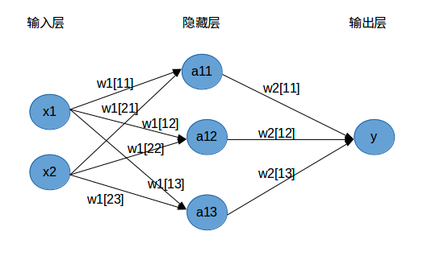
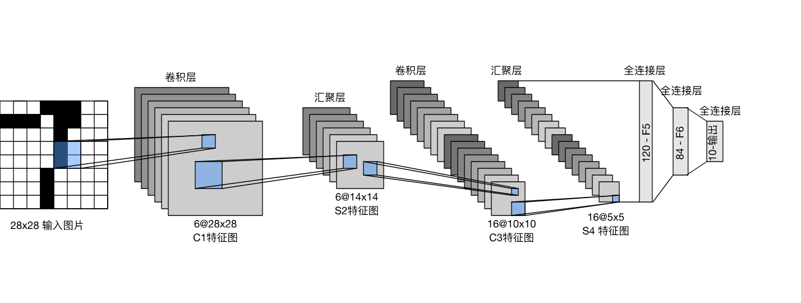
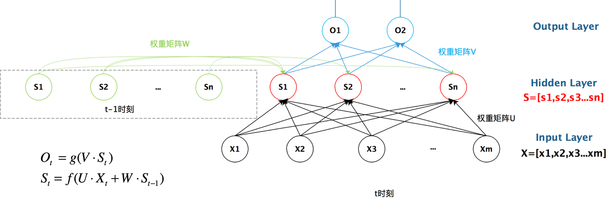
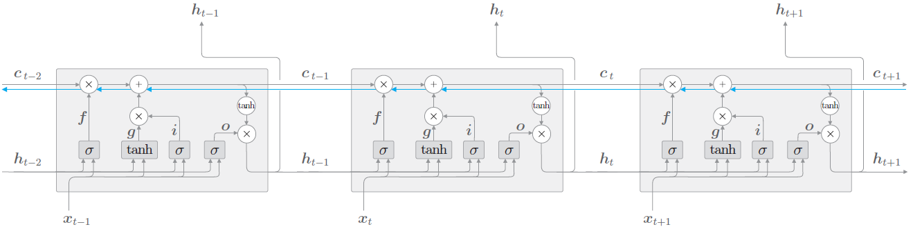

# 机器学习原理
## 一、线性回归
模型：$f(x) = w^{T}x + b$  
损失函数（残差平方和）：$J(w) = \sum_{i=1}^{n}(f(x_i)-y_i)^2$  
参数求解：
1. 穷举法
2. 最小二乘法
利用损失函数对参数求偏导，令倒数为0进行参数求值
3. 梯度下降  
公式：$w=w - a\frac{\partial J(w)}{\partial w}$  
其中a为学习率
## 二、逻辑回归
模型：$\hat{p} = \frac{1}{1 + e^{-(w^TX + b)}}$，预测结果：

$\hat{y} = \begin{cases} 1 & \text{if } \hat{p} \geq 0.5 \\ 0 & \text{if } \hat{p} < 0.5 \end{cases}$  
损失函数（交叉熵）：$J(w,b) = 
## 三、全连接神经网络（FCNN）
### 1、结构

## 四、卷积神经网络
### 1、结构

### 2、相关计算
卷积：
池化（下采样）：

### 3、相关公式
卷积/池化输出特征图尺寸公式：
$$H_{out} = \frac{H_{in} - K + 2P}{S} + 1$$
$$W_{out} = \frac{W_{in} - K + 2P}{S} + 1$$
其中：$H_{in}$、$W_{in}$ 为输入尺寸，$K$ 为卷积核尺寸，$P$ 为填充，$S$ 为步长

## 五、循环神经网络
### 1、结构：

### 2、LSTM

## 常用的激活函数：  
1. sigmoid函数：$g(z) = \frac{1}{1 + e^{-z}}$  
优点：简单，适用于分类任务
缺点：梯度消失
2. Tanh函数：
$tanh(x) = \frac{e^x - e^{-x}}{e^x + e^{-x}}$，值域 $[-1, 1]$  
导数：$y^{'} = 1 - y^2$
优点：解决了非0对称、训练更快
缺点：梯度消失
3. ReLU函数：$f(x) = \max(0, x)$
导数：$f'(x) = \begin{cases} 0 & x \leq 0 \\ 1 & x > 0 \end{cases}$  
优点：解决了梯度消失、计算简单
缺点：可能出现神经元死亡
4. Leaky ReLU函数：$f(x) = \max(\alpha x, x)$，其中 $\alpha \approx 0.01$
导数：$f'(x) = \begin{cases} \alpha & x \leq 0 \\ 1 & x > 0 \end{cases}$  
优点：解决了神经元死亡问题
缺点：无法为正负值提供关系一致的关系预测
5. SoftMax函数：$\text{SoftMax}(x_i) = \frac{e^{x_i}}{\sum_{j=1}^{n} e^{x_j}}$，将输出转换为概率分布
导数：$\frac{\partial \text{SoftMax}(x_i)}{\partial x_j} = \text{SoftMax}(x_i)(\delta_{ij} - \text{SoftMax}(x_j))$  
优点：输出值域 $[0, 1]$，所有输出之和为 1，常用于多分类问题
